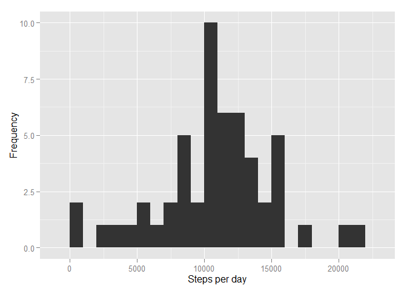
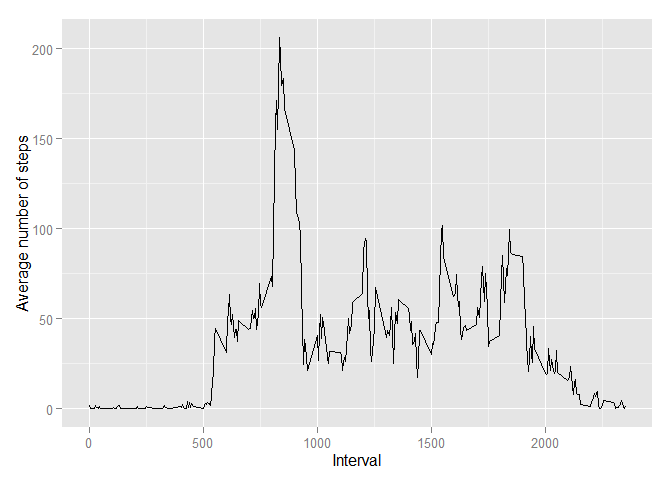
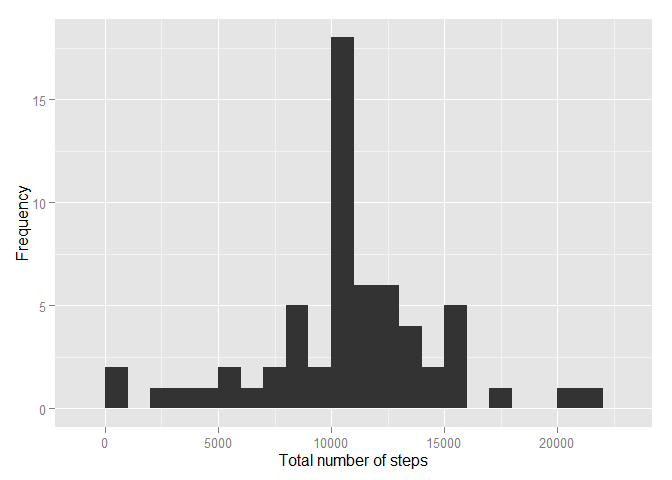
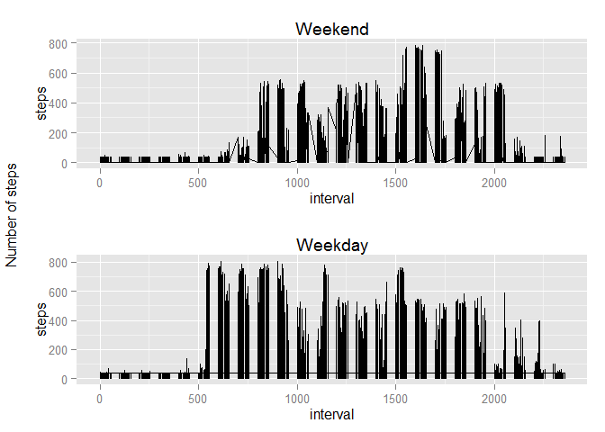

# Reproducible Research: Peer Assessment 1


## Loading and preprocessing the data

1. Load the data


```r
# Load needed libraries
library(dplyr)
```

```
## 
## Attaching package: 'dplyr'
## 
## The following object is masked from 'package:stats':
## 
##     filter
## 
## The following objects are masked from 'package:base':
## 
##     intersect, setdiff, setequal, union
```

```r
library(ggplot2)
library(lubridate)
```

```
## Warning: package 'lubridate' was built under R version 3.2.2
```

```r
library(gridExtra)
```

```
## Warning: package 'gridExtra' was built under R version 3.2.2
```

```r
# Set working directory and create data folder
setwd('C:/Users/dsanz001/Desktop/Clients/Data Science/Coursera/5. Reproducible Research/Week 2/Project1/RepData_PeerAssessment1')
if(!file.exists("./data")){
   dir.create("./data")
 }

# Unzip file into data folder
unzip("activity.zip",exdir="data")
```

2. Process and transform the data


```r
# Process and transform data as needed
activity_NA <- read.csv("data/activity.csv")
activity <- filter(activity_NA, !is.na(steps))
```


## What is mean total number of steps taken per day?

1. Calculate the total number of steps taken per day


```r
activityByDate <- group_by(activity, date)
activitySummary <- summarize(activityByDate, total_steps=sum(steps))
```


2. If you do not understand the difference between a histogram and a barplot, research the difference between them. Make a histogram of the total number of steps taken each day


```r
# Plot histogram
ggplot(data=activitySummary, aes(x=total_steps)) + geom_histogram(binwidth=1000) + xlab("Steps per day") + ylab("Frequency")
```

 

3. Calculate and report the mean and median of the total number of steps taken per day


```r
mean(activitySummary$total_steps)
```

```
## [1] 10766.19
```

```r
median(activitySummary$total_steps)
```

```
## [1] 10765
```
## What is the average daily activity pattern?

1. Make a time series plot (i.e. type = "l") of the 5-minute interval (x-axis) and the average number of steps taken, averaged across all days (y-axis)


```r
# Group data by interval, average across dates and plot
intervalSummary <- summarize(group_by(activity, interval),steps=mean(steps))
ggplot(data=intervalSummary, aes(x=interval, y=steps)) + geom_line() + xlab("Interval") + ylab("Average number of steps")
```

 

2. Which 5-minute interval, on average across all the days in the dataset, contains the maximum number of steps?


```r
intervalMaxSteps <- intervalSummary[which(intervalSummary$steps==max(intervalSummary$steps)),]$interval
```

## Imputing missing values
1. Calculate and report the total number of missing values in the dataset (i.e. the total number of rows with NAs)


```r
naValues <- is.na(activity_NA$steps)
numberOfNA <- sum(naValues)
```

2. Devise a strategy for filling in all of the missing values in the dataset. The strategy does not need to be sophisticated. For example, you could use the mean/median for that day, or the mean for that 5-minute interval, etc.


```r
# Find the positions for empty positions
naPositions <- which(is.na(activity_NA$steps))

# Create a vector to substitute NA values with mean values
naFillVector <- rep(mean(activity$steps), times=length(naPositions))
```


3. Create a new dataset that is equal to the original dataset but with the missing data filled in.


```r
# Replace NA values by mean values
activity_NA[naPositions, "steps"] <- naFillVector 
```
4. Make a histogram of the total number of steps taken each day and Calculate and report the mean and median total number of steps taken per day. Do these values differ from the estimates from the first part of the assignment? What is the impact of imputing missing data on the estimates of the total daily number of steps?


```r
# Histogram of total number of steps each day
ttlNumberOfSteps <- aggregate(activity_NA$steps, by=list(activity_NA$date), FUN=sum)
names(ttlNumberOfSteps) <- c("date", "total")
ggplot(data=ttlNumberOfSteps, aes(x=total)) + geom_histogram(binwidth=1000) + xlab("Total number of steps") + ylab("Frequency")
```

 

```r
# Mean and median for total number of steps taken per day
mean(ttlNumberOfSteps$total)
```

```
## [1] 10766.19
```

```r
median(ttlNumberOfSteps$total)
```

```
## [1] 10766.19
```


## Are there differences in activity patterns between weekdays and weekends?

1. Create a new factor variable in the dataset with two levels - "weekday" and "weekend" indicating whether a given date is a weekday or weekend day.


```r
# Identify weekend days
activityWeekdayType <- mutate(activity_NA, weekend=factor(weekdays(ymd(date)) %in% c('Saturday','Sunday')))

# Create factor variable with weekend/weekday values
activityWeekdayType$day <- sapply(activityWeekdayType$weekend, function(weekend){
  if(weekend == TRUE)
    return("weekend")
  else
    return("weekday")
})
```
2. Make a panel plot containing a time series plot (i.e. type = "l") of the 5-minute interval (x-axis) and the average number of steps taken, averaged across all weekday days or weekend days (y-axis). See the README file in the GitHub repository to see an example of what this plot should look like using simulated data.


```r
plotWeekday <- ggplot(data=subset(activityWeekdayType,day=='weekday'),aes(x=interval,y=steps))+geom_line()+ 
  ggtitle("Weekday") 
plotWeekend <- ggplot(data=subset(activityWeekdayType,day=='weekend'),aes(x=interval,y=steps))+geom_line()+ 
  ggtitle("Weekend")
grid.arrange(plotWeekend,plotWeekday, left="Number of steps")
```

 

